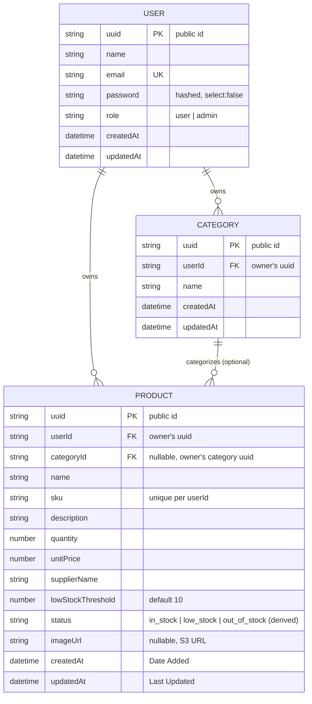

# Database Schema — Inventory Management System

MongoDB (Mongoose). Every collection has a public `uuid` (used in routes/params and
cross-schema references) in addition to Mongo's internal `_id`.

## ER Diagram

## Indexes

| Collection | Index | Purpose |
|---|---|---|
| User | `email` (unique) | login lookup, prevents duplicate accounts |
| User | `uuid` (unique) | public id lookup |
| Category | `uuid` (unique) | public id lookup |
| Category | `{ userId, name }` (unique compound) | prevents duplicate category names per user |
| Product | `uuid` (unique) | public id lookup |
| Product | `{ userId, sku }` (unique compound) | SKU is unique **per user**, not globally |
| Product | `{ userId, status }` | fast filter by stock status |
| Product | `{ userId, categoryId }` | fast filter by category |
| Product | text index on `{ name, sku }` | search support |

## Key relationships & rules

- **User → Product / Category**: one-to-many, enforced at the query layer — every
  repository function for Product/Category requires `userId` as a parameter, so
  ownership can't be bypassed by a missed check in a controller.
- **Category → Product**: optional (`categoryId` can be `null`). Deleting a category
  does **not** cascade-delete its products — it unassigns them (`categoryId: null`)
  and the delete proceeds. This mirrors how most real inventory tools behave
  (a category going away shouldn't destroy stock records).
- **Product.status** is never accepted as client input — it's derived server-side
  from `quantity` vs `lowStockThreshold` on every create/update/stock-adjust.
- **SKU uniqueness is scoped to the owning user**, not global — two different users
  can each have a product with SKU `"SHIRT-001"` without conflict.

